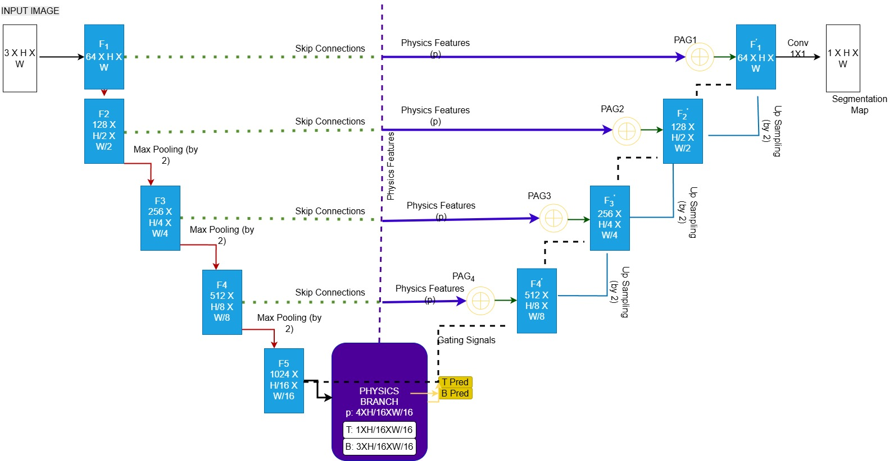
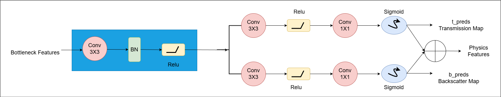

# Physics-Informed Attention U-Net (PIAUNet): An Enhanced U-Net Framework for Underwater Segmentation

This repository contains the implementation of **PIAU-Net (Physics-Informed Attention U-Net)**, a custom image segmentation framework developed in **PyTorch**.  
The model extends the classical U-Net architecture by integrating **physics-inspired features** into the network.

This project is part of a research effort focused on underwater image understanding, where visibility is affected by light scattering and turbidity.

---

## Overview

Standard encoder–decoder segmentation networks rely purely on appearance-based learning. In many real-world optical imaging scenarios, however, image formation is governed by physical processes such as light attenuation, scattering, and backscatter. Ignoring these effects often leads to unstable predictions under varying illumination.


PIAU-Net addresses this by introducing **physics-inspired components** into the architecture:

- A **Physics Branch** that learns physically meaningful cues  
- **Physics-Informed Attention Gates (PAGs)** that regulate skip connections  
- A **Physics-Guided Loss Function** that enforces physical consistency during training

The result is a segmentation model that is more robust, interpretable, and illumination-aware than conventional U-Net variants. 

> Note: Physics components are not explicitly supervised with a physics loss. They act as auxiliary learned features.

---

## Key Contributions

- **Physics-Inspired Architecture**  
  A modified U-Net that integrates additional feature maps (turbidity and backscatter) into the decoding process.

- **Physics-Informed Attention Gates (PAGs)**  
  Skip connections are filtered using learned physics features to improve feature selection.

- **Physics-Guided Loss Function**
  Training is regularized using a physics-consistency term in addition to standard segmentation loss, improving stability and boundary accuracy.

- **Deep Supervision**  
  Auxiliary outputs are used to improve training stability and convergence.

- **Clean and Modular Design**  
  The codebase is structured for clarity and easy experimentation.

---

## Model Architecture

PIAU-Net follows a U-Net style encoder–decoder design with the following enhancements:



- **Encoder**  
  Extracts hierarchical features using convolutional layers and pooling.

- **Bottleneck**
  Captures global contextual information.

- **Physics Branch**  
  Processes bottleneck features to generate:
  - Turbidity map (`t`)
  - Backscatter map (`b`)


- **Physics-Informed Attention Gates**  
  Use physics features as gating signals to refine skip-connection information before fusion with the decoder.

- **Decoder**  
  Reconstructs spatial information using upsampling and gated skip connections.

- **Outputs**
  Produces a single-channel output followed by a sigmoid activation for binary segmentation.

---

## Physics-Guided Learning
The attention mechanism is not purely data-driven. Physics-derived features guide the gating process to:

- Suppress features from low-visibility or physically inconsistent regions 
- Emphasize regions with reliable optical information
- Improve boundary localization under illumination changes

---

## Training Strategy

### Loss Function

The model is trained using:

- **Cross-Entropy Loss** (main segmentation)
- **Auxiliary loss** (deep supervision)


---

### Optimization

- **Optimizer:** Adam  
- **Scheduler:** Cosine Annealing  
- **Mixed Precision Training (AMP)**  
- **Gradient Clipping**  

---

## Datasets

Example dataset:  
1. [A Large-Scale Fish Dataset](https://www.kaggle.com/datasets/crowww/a-large-scale-fish-dataset)

Structure:
```
dataset_root/
├── images/
│ ├── sample_001.jpg
│ └── ...
└── masks/
├── sample_001.png
└── ...
```

2. [AquaOV255 Dataset](https://arxiv.org/abs/2511.07923)

Structure:
```
AquaOV255/
├── images/
│ ├── Abalone0830001.jpg
│ └── ...
└── masks/
├── Abalone0830001.png
└── ...
```


- Masks must be binary:
  - `0` → Background  
  - `1` → Foreground  

### Data Processing

- Invalid masks are filtered automatically  
- Optional CLAHE enhancement is applied  
- Images are resized and normalized  

---

## Evaluation Metrics

- Pixel Accuracy  
- Mean IoU (mIoU)  
- Dice Score  
- Precision  
- Recall  

---

## Running the Code

### Train

```bash
python main.py --mode train --dataset_root ./AquaOV255 --epochs 30
```

#### Resume Training
```bash
python main.py --mode train --checkpoint path/to/checkpoint.pth
```

### Test
```bash
python main.py --mode test --checkpoint path/to/checkpoint.pth
```
### Hyperparameter Tuning
```bash
python main.py --mode tune
```

---

## Testing Features
- Test-Time Augmentation (horizontal flip)
- Per-image IoU evaluation
- Top-K best predictions saved
- Full visualization support

---

## Visualization
The project provides:
- Image | Ground Truth | Prediction comparison
- Individual prediction outputs

---

## Dependencies
```bash
pip install torch torchvision numpy opencv-python matplotlib tqdm scikit-learn
```
A CUDA-enabled GPU is recommended.

---

## Limitations

- Physics outputs (t, b, j) are not explicitly supervised
- Attention depends on learned turbidity
- Currently supports binary segmentation only

---

## Extensibility
The framework can be extended to: 
- Multi-class segmentation
- Object detection preprocessing

---

## Summary

PIAU-Net demonstrates how physics-inspired ideas can be integrated into a deep learning segmentation model while keeping the system simple and trainable.

However, the current implementation is primarily segmentation-driven, and physics components act as auxiliary features rather than strictly enforced constraints.